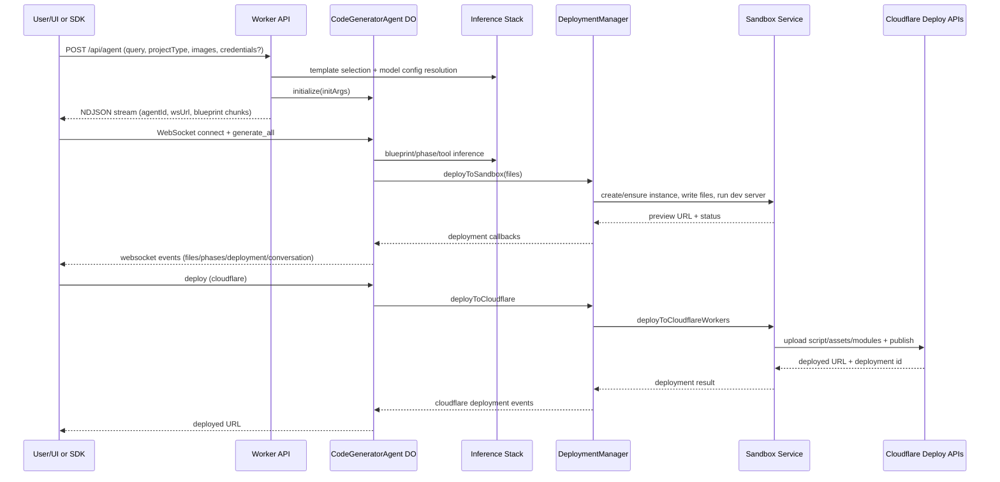

# VibeSDK Architecture Deep Dive

Last updated: 2026-02-16

## 1. Purpose and Scope

This document explains how this repository works end to end:

- how app creation starts
- how the `CodeGeneratorAgent` (coding agent) plans and writes code
- how `DeploymentManager` builds, previews, retries, and deploys
- how the system talks to underlying LLM providers
- how frontend chat/websocket state stays in sync
- what changed in this fork compared with upstream base

This is intended as a single-source technical onboarding doc.

## 2. System-at-a-Glance

VibeSDK is a 3-plane system:

1. Control Plane (Worker API + auth + routing):
   - Receives app creation requests
   - Routes traffic between main app/API and generated app subdomains
2. Agent Plane (Durable Object runtime):
   - Stateful `CodeGeneratorAgent` per app/session
   - Planning, generation, tool-calling, conversation orchestration
3. Runtime Plane (Sandbox + deployment):
   - Ephemeral preview runtime in Containers
   - Permanent deployment to Workers for Platforms / Worker script

## 3. Core Runtime Routing

Main entrypoint: `worker/index.ts`

- Main domain (`CUSTOM_DOMAIN`, local `localhost`):
  - serves frontend assets for non-API routes
  - serves `/api/*` via Hono app (`worker/app.ts`)
  - exposes AI proxy endpoint at `/api/proxy/openai`
- Subdomains:
  - first tries live preview sandbox proxy (`proxyToSandbox`)
  - fallback to Workers for Platforms dispatcher namespace (`env.DISPATCHER`)
- Browser-native preview special case:
  - host format: `b-{agentId}-{token}.{previewDomain}`
  - request forwarded directly to `CodeGeneratorAgent.handleBrowserFileServing`

## 4. API and Session Bootstrap

### 4.1 Route wiring

- `worker/api/routes/codegenRoutes.ts`
  - `POST /api/agent` -> start app creation
  - `GET /api/agent/:agentId/ws` -> websocket upgrade
  - `GET /api/agent/:agentId/connect` -> reconnect metadata
  - `GET /api/agent/:agentId/preview` -> preview deployment trigger

### 4.2 Start flow (`POST /api/agent`)

Controller: `worker/api/controllers/agent/controller.ts` (`startCodeGeneration`)

Sequence:

1. Validate prompt and size (`MAX_AGENT_QUERY_LENGTH = 20,000`)
2. Enforce app-creation rate limits
3. Resolve behavior + project type:
   - `app` -> `phasic`
   - `presentation`, `workflow`, `general` -> `agentic`
4. Load user model overrides from D1 (`ModelConfigService`)
5. Apply runtime credential overrides (`credentialsToRuntimeOverrides`) for SDK/BYOK
6. Select template (`getTemplateForQuery`)
7. Stream early NDJSON metadata (agentId, ws URL, selected template files)
8. Instantiate DO stub (`getAgentStub`) and call `initialize(...)`
9. Stream blueprint chunks while initializing
10. Return streaming response (`text/event-stream` carrying NDJSON lines)

## 5. Durable Object Agent (`CodeGeneratorAgent`)

File: `worker/agents/core/codingAgent.ts`

Responsibilities:

- owns app/session state
- initializes behavior strategy (`phasic` or `agentic`)
- owns websocket lifecycle
- delegates file/deployment/git operations to services
- stores full + compact conversations in DO SQLite tables

### 5.1 Services inside agent

- `FileManager` (`worker/agents/services/implementations/FileManager.ts`)
  - generated file map
  - template + generated file overlay
  - diff generation and git staging/commit integration
- `DeploymentManager` (`worker/agents/services/implementations/DeploymentManager.ts`)
  - sandbox deploy orchestration with retries and resilience controls
- `GitVersionControl` (`worker/agents/git/git.ts`)
  - DO-local git history via sqlite-backed filesystem

### 5.2 Conversation persistence model

In DO SQL tables:

- `full_conversations`
- `compact_conversations`

Reason: DO row-size constraints for state snapshots. Compact and full history are separated to avoid oversized state payloads.

## 6. Behavior Modes

Behavior base: `worker/agents/core/behaviors/base.ts`

Two concrete strategies:

### 6.1 Phasic mode (`PhasicCodingBehavior`)

File: `worker/agents/core/behaviors/phasic.ts`

Used for `projectType=app`. Deterministic state machine:

- `PHASE_GENERATING`
- `PHASE_IMPLEMENTING`
- `FINALIZING`
- `REVIEWING`
- `IDLE`

Core loop:

1. Generate/choose next phase (`PhaseGenerationOperation`)
2. Implement files for that phase (`PhaseImplementationOperation`)
3. Save files + deploy preview
4. Run static analysis + deterministic fixes + optional smart fixes
5. Repeat until completion/final phase

### 6.2 Agentic mode (`AgenticCodingBehavior`)

File: `worker/agents/core/behaviors/agentic.ts`

Used for `presentation`, `workflow`, `general`. Tool-driven autonomous loop:

1. Build prompt + dynamic hints + current file/context summary
2. Run `AgenticProjectBuilderOperation` with tool set
3. Tools generate/regenerate files, deploy preview, run analysis, etc.
4. Completion signal tool (`mark_generation_complete`) ends recursion
5. Pending user queue can interrupt and continue in follow-up passes

Agentic loop aggressively relies on conversation + tool state continuity.

## 7. Planning and Template Selection

### 7.1 Template selection

Files:

- `worker/agents/planning/templateSelector.ts`
- `worker/agents/index.ts` (`getTemplateForQuery`)

Flow:

1. Optionally auto-predict project type when `projectType=auto`
2. Filter templates from catalog
3. LLM picks template via schema
4. Fetch template details from R2 zip (`BaseSandboxService.getTemplateDetails`)
5. Fallback to scratch template when needed

### 7.2 Blueprint generation

File: `worker/agents/planning/blueprint.ts`

- `phasic` -> detailed PRD schema (`PhasicBlueprintSchema`)
- `agentic` -> plan-oriented schema (`AgenticBlueprintSchema`)
- supports chunked streaming for frontend incremental display

## 8. Tooling and Tool Execution Engine

### 8.1 Tool surface

Tool registry:

- `worker/agents/tools/customTools.ts`
- toolkit files in `worker/agents/tools/toolkit/*`

Notable tools:

- `generate_files`, `regenerate_file`
- `deploy_preview`, `run_analysis`, `get_runtime_errors`, `get_logs`
- `exec_commands`, `git`
- `queue_request` (queues user request to next generation phase)
- `deep_debug` (autonomous debugging session, one call per turn limit)

### 8.2 Dependency-aware parallel tool execution

Files:

- `worker/agents/inferutils/toolExecution.ts`
- `worker/agents/tools/resources.ts`

Tool calls are grouped by resource conflicts:

- file write/read overlap
- exclusive sandbox operations (`exec`, `analysis`, `deploy`)
- blueprint exclusivity
- git commit vs file write conflicts

Independent calls run in parallel; dependent calls are ordered.

### 8.3 Completion signal handling

Files:

- `worker/agents/inferutils/completionDetection.ts`
- `worker/agents/tools/toolkit/completion-signals.ts`

LLM recursion stops when completion tool is observed:

- `mark_generation_complete`
- `mark_debugging_complete`

## 9. Inference Stack (Underlying Base LLM Interaction)

### 9.1 Config and constraints

Files:

- `worker/agents/inferutils/config.ts`
- `worker/agents/inferutils/config.types.ts`
- `worker/api/controllers/modelConfig/constraintHelper.ts`

Model config precedence:

1. user override from D1
2. default action config (`AGENT_CONFIG`)

Constraints checked per action (`AGENT_CONSTRAINTS`).

### 9.2 Inference wrapper

File: `worker/agents/inferutils/infer.ts`

- merges config + validates model constraints
- retry loop with exponential backoff
- fallback model switching
- parse/regeneration retry path when response invalid

### 9.3 Core client and provider routing

File: `worker/agents/inferutils/core.ts`

Capabilities:

- OpenAI-compatible client calls
- Cloudflare AI Gateway URL construction
- runtime gateway override support (`runtimeOverrides.aiGatewayOverride`)
- runtime BYOK provider key support (`runtimeOverrides.userApiKeys`)
- optional wholesaling headers (`cf-aig-authorization`)
- streaming output + robust tool-call delta accumulation
- recursive tool-call orchestration with depth limits
- completion signal detection and stop conditions

### 9.4 App-level AI proxy for generated apps

File: `worker/services/aigateway-proxy/controller.ts`

- `POST /api/proxy/openai` validates JWT scoped to app + owner
- enforces LLM rate limits
- resolves model configuration and forwards request to provider/gateway
- attaches `cf-aig-metadata`

## 10. DeploymentManager (`deploymentmanager`) Deep Dive

File: `worker/agents/services/implementations/DeploymentManager.ts`

This service coordinates preview deployment and permanent deployment.

### 10.1 Preview deploy resilience controls

- single in-flight promise shared by concurrent callers
- per-attempt timeout: 150s
- master timeout: 5m
- generation tokens detect stale retry loops and prevent stale mutation
- circuit breaker:
  - threshold: 5 consecutive startup-like failures
  - cooldown: 60s
- periodic health checks; unhealthy instance triggers redeploy
- setup command replay after redeploy

### 10.2 Preview deploy process

1. ensure instance exists + healthy (`ensureInstance`)
2. write requested files to sandbox
3. optional logs/error clear
4. start health checks
5. broadcast deployment lifecycle events

### 10.3 Cloudflare deployment process

`deployToCloudflare` delegates to sandbox service deployment:

- checks generated files + sandbox instance
- calls `deployToCloudflareWorkers(...)`
- propagates success/failure callbacks
- updates deployment id in app DB on success

## 11. Sandbox Runtime and Build/Deploy Execution

Sandbox abstraction: `worker/services/sandbox/BaseSandboxService.ts`

Implementations:

- `SandboxSdkClient` (`worker/services/sandbox/sandboxSdkClient.ts`) [default]
- `RemoteSandboxServiceClient` (`worker/services/sandbox/remoteSandboxService.ts`) when `SANDBOX_SERVICE_TYPE=runner`

Factory: `worker/services/sandbox/factory.ts`

### 11.1 SandboxSdkClient preview lifecycle

1. create instance directory
2. write template/project files (bulk script write)
3. update project config (`package.json`, `wrangler.jsonc`)
4. provision placeholder resources from wrangler placeholders
5. store wrangler config in KV (`VibecoderStore`)
6. install dependencies (`bun install`)
7. start dev server (`bun run dev`) with monitor-cli
8. expose preview port with preview domain mapping

### 11.2 File writing robustness (fork change)

Implemented in `writeFilesViaScript(...)`:

- deterministic UTF-8 base64 encoding (`Buffer.from(...).toString('base64')`)
- safe shell quoting for paths
- unique temp script path per operation
- cleanup in `finally`
- explicit partial failure reporting

### 11.3 Static analysis in sandbox

Runs:

- `bun run lint`
- `bunx tsc -b --incremental --noEmit --pretty false`

Returns normalized lint/typecheck issue structures.

### 11.4 Permanent deployment packaging

Inside `deployToCloudflareWorkers(...)`:

1. run build (`bun run build`, then `bunx wrangler build`)
2. read wrangler config from KV
3. load worker script from `dist/index.js`
4. collect additional modules (`dist/assets/*.js`)
5. collect static assets from `dist/client`
6. create asset manifest
7. deploy via pure deployer APIs:
   - `worker/services/deployer/deploy.ts`
   - `worker/services/deployer/deployer.ts`

Target:

- `platform` -> dispatch namespace deployment
- `user` -> direct worker deployment path (when supported by backend/service)

## 12. WebSocket Protocol and Frontend Sync

Backend websocket handler:

- `worker/agents/core/websocket.ts`

Frontend hook and message reducer:

- `src/routes/chat/hooks/use-chat.ts`
- `src/routes/chat/utils/handle-websocket-message.ts`

Key websocket flows:

- `generate_all`, `stop_generation`, `resume_generation`
- `preview`, `deploy`, `user_suggestion`
- `get_conversation_state`, `get_model_configs`
- vault sync events

### 12.1 Frontend resilience behavior

- reconnect with exponential backoff
- session restore from `conversation_state` and `agent_connected`
- preview deploy dedupe with in-flight refs
- stale preview guard reset after timeout
- malformed websocket envelope normalization (JSON encoded in `type` field)

## 13. File System and Git Model

Primary persistent source of truth: DO-managed virtual file state + git history.

- `FileManager` tracks generated map + diffs
- template files are overlaid with generated file changes
- git commits are created for key checkpoints
- sandbox filesystem is execution target and can lag until next deploy sync

Agentic prompting explicitly treats this as a two-filesystem architecture.

## 14. Security, Auth, and Rate Limiting

### 14.1 HTTP middleware stack

`worker/app.ts`:

- secure headers
- CORS
- CSRF double-submit cookie enforcement
- global API rate limiting
- auth middleware (owner/authenticated/public route levels)

### 14.2 WebSocket auth

- JWT auth through standard middleware
- ticket-based auth path supported (`/api/ws-ticket`)
- ticket storage/consumption in DOs (one-time short-lived tickets)

### 14.3 Additional controls

- IP host access blocked for direct IP requests
- origin checks for non-ticket websocket connections
- app-level AI proxy JWT scope validation

## 15. Feature Gating and Project Types

Feature definitions:

- `worker/agents/core/features/types.ts`
- capabilities endpoint: `worker/api/controllers/capabilities/controller.ts`

Project types:

- `app`
- `presentation`
- `workflow`
- `general`

Behavior mapping:

- `app` -> `phasic`
- others -> `agentic`

Platform enablement is controlled by `PLATFORM_CAPABILITIES` config.

## 16. SDK Interaction Model

SDK sources:

- `sdk/src/client.ts`
- `sdk/src/session.ts`

Flow:

1. `client.build(...)` calls `POST /api/agent`
2. consumes NDJSON for start event and blueprint chunks
3. creates `BuildSession`
4. obtains websocket ticket per connect/reconnect
5. auto-connect and optionally auto-generate
6. exposes wait helpers (`wait.deployable`, `wait.previewDeployed`, etc.)

Credentials can be passed for runtime inference overrides.

## 17. Fork Functional Changes Summary

Reference: `changes-versus-base.md`

Functional deltas in this fork (post-format wave):

1. Sandbox file-write reliability hardening
2. Frontend preview deploy dedupe + malformed WS envelope normalization
3. Deployment retry hardening:
   - increased timeouts
   - stale-loop generation token guards
   - circuit breaker + cooldown
4. Apple Silicon local sandbox platform support adjustments
5. Model inference config/fallback updates

## 18. Current Gaps / Notable Constraints

1. Presentation export strategies (`pdf`, `pptx`, `googleslides`) are declared but currently return "not yet implemented" in objective strategy code.
2. BYOK helper status currently reports providers with `hasValidKey: false` placeholder behavior in `worker/api/controllers/modelConfig/byokHelper.ts`.
3. Some comments/prompts mention historical or aspirational flows (for example autonomous code-review loops) that are not represented as a dedicated standalone operation in the current backend state machine.

## 19. End-to-End Sequence (Concrete)

## 20. High-Value Code Reading Order

If you want to re-load this architecture quickly, read in this order:

1. `worker/index.ts`
2. `worker/api/controllers/agent/controller.ts`
3. `worker/agents/core/codingAgent.ts`
4. `worker/agents/core/behaviors/base.ts`
5. `worker/agents/core/behaviors/phasic.ts`
6. `worker/agents/core/behaviors/agentic.ts`
7. `worker/agents/services/implementations/DeploymentManager.ts`
8. `worker/services/sandbox/sandboxSdkClient.ts`
9. `worker/agents/inferutils/infer.ts`
10. `worker/agents/inferutils/core.ts`
11. `src/routes/chat/hooks/use-chat.ts`
12. `src/routes/chat/utils/handle-websocket-message.ts`
13. `changes-versus-base.md`

